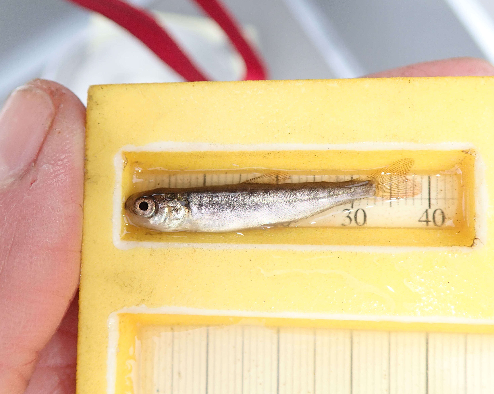

Website last updated `r Sys.time()` by Benjamin Meyer (bemeyer@alaska.edu)

```{r setup, include=FALSE}
knitr::opts_chunk$set(echo = TRUE)
#knitr:: opts_knit$set(root.dir = "~/Dropbox/Chena_Data_2020/Chena Drift Project Data_SFR/UAF Chena Drift Data/Fish")
knitr::opts_chunk$set(warning = FALSE, message = FALSE)
```

<br>



<br>

### Introduction
This document will summarize and plot observed growth of juvenile Chinook salmon in the Chena River.  Data is primarily from summers 2019-2020, with some comparisons to data from summers 2008 2009 (Benson et al.), and 2015 (Huntsman and Falke et al).

<br>


```{r initialize script, include=FALSE}

# set working directory for local data source
# setwd() doesn't work in Markdown; did it in previous step
#setwd("~/Dropbox/Chena_Data_2020/Chena Drift Project Data_SFR/UAF Chena Drift Data/Fish")

# clear environment
rm(list=ls())

# Load packages and read in data---------
library(tidyverse)
library(readxl)

# set ggplot theme
theme_set(theme_bw(12))

```

```{r read in data, include = FALSE}
# read in data from project directory

## 2019
### 2019 sites
sites2019 <- read_excel("data/Fish/2019/2019 Data Inputs/Chinook catch 2019.xlsx", sheet = "Sites") %>% mutate(`General Area` = "Upper Chena Mainstem")
### 2019 fish data
fish2019 <- read_excel("data/Fish/2019/2019 Data Inputs/Chinook catch 2019.xlsx", sheet = "Fish")

## 2020
### 2020 sites
sites2020 <- read_excel("data/Fish/2020/2020 Data Inputs/Fishing Data 2020.xlsx", sheet = "Fishing_Sites") %>% 
  select(GPSwpt, Lat, Lon, `General Area`)
### 2020 fish data
fish2020 <- read_excel("data/Fish/2020/2020 Data Inputs/Fish Datasheet 2020.xlsx", skip = 3)

# Other years [***Question - Do we have coordinates for these historical data?***]
growth.2008.2009 <- read_excel("data/Fish/Historical Data/Historical Data Inputs/Chena Chinook growth from literature.xlsx", sheet = "Summary.2008-2009")
growth.2015 <- read_excel("data/Fish/Historical Data/Historical Data Inputs/Chena Chinook growth from literature.xlsx", sheet = "Summary.2015")

# Clean up and summarize data----------
## Convert 2019 data date to date format and join with site data
fish2019  <- fish2019 %>%
  mutate(Date = ymd(Date)) %>%
  left_join(sites2019, by = "GPSwpt") %>%
  select(-DatasheetOrder,-TL_mm,-Description) %>%
  rename(General.Area = `General Area`)

# General Note: do not alter 2019 data formats, because J. Neuswager may be already using these sheets as is for other script analyses.  Instead, make 2020 data conform to 2019 formats.

# reformat 2020 data to join with 2019 data
fish2020 <- fish2020 %>%
  rename(GPSwpt = Site,
         ObserverName = Observer,
         FL_mm = `FL (mm)`,
         Wt_g = `Wt (g)`,
         Mortality = `Mort?`) %>%
  select(-`Disposition (MR/ID)`, -`Aqui-S bath#`,-`Data Entry`,-`Addl. Count`,-Count) %>%
  left_join(sites2020, by = "GPSwpt") %>%
  transform(FL_mm = as.numeric(FL_mm),
            Wt_g = as.numeric(Wt_g),
            Lat = as.character(Lat),
            Lon = as.character(Lon))  %>%
  filter(General.Area != "South Fork Chena")

# join 2019 and 2020 data
fish <- bind_rows(fish2019,fish2020) %>%
  mutate(year = year(Date)) %>%
  filter(Species == "Chinook")

 (z<- fish %>%
  group_by(year) %>%
  summarise(chinook_count = n()))
```


```{r individual years, include = FALSE}
# Screen for outliers / data entry errors

# Plot seperate 2019 and 2020 L-W relationship (overall)
lw.plot.2019 <- fish %>%
  filter(year == "2019") %>%
  ggplot(aes(x = FL_mm, y = Wt_g)) +
  geom_point() 
lw.plot.2019

lw.plot.2020 <- fish %>%
  filter(year == "2020") %>%
  ggplot(aes(x = FL_mm, y = Wt_g)) +
  geom_point()
lw.plot.2020

```

### Length-Weight relationships
```{r faceted ggplot}

# Plot 2019 and 2020 L-W relationships (overall)
fish %>%
  filter(!is.na(FL_mm),
         !is.na(Wt_g)) %>%
  ggplot(aes(x = FL_mm, y = Wt_g)) +
  geom_point() +
  facet_grid(. ~ year) +
  theme(strip.text = element_text(face="bold", size=14)) +
  xlab("Fork Length (mm)") +
  ylab("Weight (g)") +
  ggtitle("Length-Weight Relationships") 
```

We examined suspected outliers based on this plot and corrected a few data entry errors. We did not change apparent outliers when they matched the paper datasheet

<br>

### Size data summary tables
```{r}
## 2019
growth.summary.2019 <- fish %>%
  filter(Species == "Chinook" & year(Date) == 2019) %>%
  group_by(Date, General.Area) %>%
  summarize(nFL = sum(!is.na(FL_mm)),
            meanFL = mean(FL_mm, na.rm = T),
            sdFL = sd(FL_mm, na.rm = T),
            nWt = sum(!is.na(Wt_g)),
            meanWt = mean(Wt_g, na.rm = T),
            sdWt = sd(Wt_g, na.rm = T)
            ) %>%
  mutate(seFL = sdFL / sqrt(nFL),
         seWt = sdWt / sqrt(nWt)) %>%
  filter(nWt > 1) %>%
  select(Date,General.Area,nFL,meanFL,sdFL,seFL,nWt,meanWt,sdWt,seWt)

# save table to project directory
write_csv(growth.summary.2019, "output/tables/growth.summary.2019.csv")

```

Growth Summary 2019 Table
```{r}
growth.summary.2019
```

<br>

```{r}
## 2020
growth.summary.2020 <- fish %>%
  filter(Species == "Chinook" & year(Date) == 2020) %>%
  group_by(Date, General.Area) %>%
  summarize(nFL = sum(!is.na(FL_mm)),
            meanFL = mean(FL_mm, na.rm = T),
            sdFL = sd(FL_mm, na.rm = T),
            nWt = sum(!is.na(Wt_g)),
            meanWt = mean(Wt_g, na.rm = T),
            sdWt = sd(Wt_g, na.rm = T)
  ) %>%
  mutate(seFL = sdFL / sqrt(nFL),
         seWt = sdWt / sqrt(nWt)) %>%
  filter(nWt > 1) %>%
  select(Date,General.Area,nFL,meanFL,sdFL,seFL,nWt,meanWt,sdWt,seWt)

# save table to project directory
write_csv(growth.summary.2020, "output/tables/growth.summary.2020.csv")

```

Growth Summary 2020 Table
```{r}
growth.summary.2020
```
<br>

***

<br>

### Growth Plots

Note: For visualization purposes, juvenile Chinook salmon capture data from 8/18/20 and 8/19/20 at the Upper Reach section are combined in to a single sampling day (8/19/20) to better align with temporal resolution of overall data set, which is spaced at appx. two week intervals.
```{r}
growth.summary.2020 <- fish %>%
  filter(Species == "Chinook" & year(Date) == 2020) %>%
  # replace size data observed on 8/18/20 with the date of 8/19/20
  mutate(Date = date(str_replace(Date,"2020-08-18","2020-08-19"))) %>%
  group_by(Date, General.Area) %>%
  summarize(nFL = sum(!is.na(FL_mm)),
            meanFL = mean(FL_mm, na.rm = T),
            sdFL = sd(FL_mm, na.rm = T),
            nWt = sum(!is.na(Wt_g)),
            meanWt = mean(Wt_g, na.rm = T),
            sdWt = sd(Wt_g, na.rm = T)
  ) %>%
  mutate(seFL = sdFL / sqrt(nFL),
         seWt = sdWt / sqrt(nWt)) %>%
  filter(nWt > 1) %>%
  select(Date,General.Area,nFL,meanFL,sdFL,seFL,nWt,meanWt,sdWt,seWt)

```


<br>

#### 2019 Weight and Length by Sample Event
```{r}
# Plot the 2019 growth trajectories in terms of fork length and weight
growthFL.plot.2019 <- ggplot(data = growth.summary.2019, aes(x = Date, y = meanFL, color = General.Area)) +
  geom_point() +
  geom_line() +
  geom_errorbar(aes(ymin = meanFL - seFL, ymax = meanFL + seFL), size = 0.5) +
  scale_y_continuous(name = "Fork length (mm)") +
  ggtitle( "2019 Fork Lengths")
growthFL.plot.2019

# save figure
ggsave("output/figures/2019 results/2019FL.png")

growthWt.plot.2019 <- ggplot(data = growth.summary.2019, aes(x = Date, y = meanWt, color = General.Area)) +
  geom_point() +
  geom_line() +
  geom_errorbar(aes(ymin = meanWt - seWt, ymax = meanWt + seWt), size = 0.5) +
  scale_y_continuous(name = "Weight (g)") +
  ggtitle( "2019 Weights")
growthWt.plot.2019

# save figure
ggsave("output/figures/2019 results/2019Wt.png")
```

<br>

#### 2020 Weight and Length by Sample Event
```{r}
# Plot the 2020 growth trajectories in terms of fork length and weight
growthFL.plot.2020 <- ggplot(data = growth.summary.2020, aes(x = Date, y = meanFL, color = General.Area)) +
  geom_point() +
  geom_line() +
  geom_errorbar(aes(ymin = meanFL - seFL, ymax = meanFL + seFL), size = 0.5) +
  scale_y_continuous(name = "Fork length (mm)")+
  ggtitle( "2020 Fork Lengths")
growthFL.plot.2020

# save figure
ggsave("output/figures/2020 results/2020FL.png")

growthWt.plot.2020 <- ggplot(data = growth.summary.2020, aes(x = Date, y = meanWt, color = General.Area)) +
  geom_point() +
  geom_line() +
  geom_errorbar(aes(ymin = meanWt - seWt, ymax = meanWt + seWt), size = 0.5) +
  scale_y_continuous(name = "Weight (g)") +
  ggtitle( "2020 Weights")
growthWt.plot.2020

# save figure
ggsave("output/figures/2020 results/2020Wt.png")
```

<br>

#### 2019 vs. 2020 Size Data
```{r}
# compare plots of 2019 to 2020 data
growth.summary.all <- bind_rows(growth.summary.2019,growth.summary.2020) %>% 
  mutate(year = year(Date),
         yday = yday(Date)) 
  # create column with general date format
  ## not sure how to do this part!!  using day of year for x-axes instead for now
  #mutate(general_date = as.Date(Date, "%Y-%m"))
           
# fork length
growthFL.plot.all <- ggplot(data = growth.summary.all, aes(x = yday, y = meanFL, color = General.Area)) +
  geom_point() +
  geom_line() +
  geom_errorbar(aes(ymin = meanFL - seFL, ymax = meanFL + seFL), size = 0.5) +
  facet_grid(. ~ year) +
  scale_y_continuous(name = "Fork length (mm)") +
   theme(strip.text = element_text(face="bold", size=14)) +
  ggtitle("2019-2020 Juvenile Chinook Fork Lengths")
  #scale_x_date()
growthFL.plot.all

# save figure
ggsave("output/figures/general results/growthFL.png")

# weight
growthFL.plot.all.wt <- ggplot(data = growth.summary.all, aes(x = yday, y = meanWt, color = General.Area)) +
  geom_point() +
  geom_line() +
  geom_errorbar(aes(ymin = meanWt - seWt, ymax = meanWt + seWt), size = 0.5) +
  facet_grid(. ~ year) +
  scale_y_continuous(name = "Weight (g)") +
   theme(strip.text = element_text(face="bold", size=14)) +
  ggtitle("2019-2020 Juvenile Chinook Fork Weights")
  #scale_x_date()
growthFL.plot.all.wt

# save figure
ggsave("output/figures/general results/growthWt.png")
```


```{r}
# Historical data
## Clean up the historic growth data---------
growth.summary.2008.2009 <- growth.2008.2009 %>%
  mutate(Date = ymd(Date),
         nFL = count,
         nWt = ifelse(is.na(meanWt), NA, count),
         General.Area = "Various Mainstem") %>%
  select(Date,General.Area,nFL,meanFL,sdFL,seFL,nWt,meanWt,sdWt,seWt)

growth.summary.2015 <- growth.2015 %>%
  filter(Habitat == "Main stem") %>%
  mutate(nFL = Count,
         nWt = Count,
         seFL = sdFL / sqrt(nFL),
         seWt = sdWt / sqrt(nWt),
         Date = ymd(DateEstimated),
         General.Area = "Various Mainstem") %>%
  select(Date,General.Area,nFL,meanFL,sdFL,seFL,nWt,meanWt,sdWt,seWt)

growth.summary.all <- bind_rows(growth.summary.2008.2009, growth.summary.2015, growth.summary.2019,growth.summary.2020) %>%
  mutate(Year = factor(year(Date)),
         # Calculate day of year (Julian date)
         DOY = yday(Date))

```


<br>

#### Historical juvenile Chinook size data
```{r}
# Plot growth curves from all 5 years
# Plot the 2019 growth trajectories in terms of fork length and weight
growthFL.plot.all <- ggplot(data = growth.summary.all, aes(x = DOY, y = meanFL, color = Year)) +
  geom_point() +
  geom_line() +
  geom_errorbar(aes(ymin = meanFL - seFL, ymax = meanFL + seFL), size = 0.5) +
 # scale_x_date(name = "Date") +
  scale_y_continuous(name = "Fork length (mm)") +
  facet_grid(. ~ General.Area) +
  theme(strip.text = element_text(face="bold", size=14)) +
  ggtitle("Chena River juvenile Chinook salmon size data 2009 - 2020")
growthFL.plot.all

#save figure
ggsave("output/figures/general results/Growth FL_all years.png", height = 6, width = 10)

```


```{r calculation, include = FALSE }
# How much smaller was final weight in 2019 compared to 2009?
(meanWt.2019_2009 <- (1 - 3.38 / 5.5))
meanWt.2019_2009 <- round(meanWt.2019_2009,3)
```

<br>

Note that end-of-summer size in 2009 is larger than most other years.  For example, in 2019 final weight was `r meanWt.2019_2009` g smaller compared to 2009.

<br>


```{r}
# set theme
plot_theme <- theme(
  axis.text = element_text(size = 14),
  axis.title = element_text(size = 16, face = "bold" ),
  plot.title = element_text(size = 16, face = "bold"),
  legend.background = element_blank(),
  legend.box.background = element_rect(colour = "black"))

# plot
growthWt.plot.all <- growth.summary.all %>%
  filter(General.Area != "Lower Chena Mainstem") %>%
  ggplot(aes(x = DOY, y = meanWt, color = Year)) +
  geom_point() +
  geom_line() +
  geom_errorbar(aes(ymin = meanWt - seWt, ymax = meanWt + seWt), size = 0.5) +
 # scale_x_date(name = "Date") +
  scale_y_continuous(name = "Weight (g)", breaks = c(0:6)) +
  ggtitle("Chena River Juvenile Chinook Salmon Weights 2009 - 2020") +
  xlab("") +
  scale_x_continuous(breaks = c(152,182,213,244),
                     labels = c("June","July","August","Sept")) +
  plot_theme
growthWt.plot.all

# save
ggsave("output/figures/general results/weight_2009_2020.png",height = 5, width = 8)


```
Note: In the above plot, size data from 2020 Lower Chena Mainstem is absent for visual simplicity.

<br>


```{r}

# Plot weight curves from 2009, 2015, and 2019 only
growth.summary.3yr <- growth.summary.all %>%
  filter(Year %in% c("2009","2015","2019"))

growthWt.plot.3yr <- ggplot(data = growth.summary.3yr, aes(x = DOY, y = meanWt, color = Year)) +
  geom_point() +
  geom_line() +
  geom_errorbar(aes(ymin = meanWt - seWt, ymax = meanWt + seWt), size = 0.5) +
  #scale_x_date(name = "Date") +
  scale_y_continuous(name = "Weight (g)", breaks = c(0:6)) +
  ggtitle("Chena River Juvenile Chinook salmon weights 2009 - 2019")
growthWt.plot.3yr
ggsave("output/figures/general results/growth_wt_3yrs.png", height = 6, width = 6)

```

#### Data source
Files used in this analysis stored in Dropbox repository; ~/Dropbox/Chena_Data_2020/Chena Drift Project Data_SFR/UAF Chena Drift Data/Fish.  
